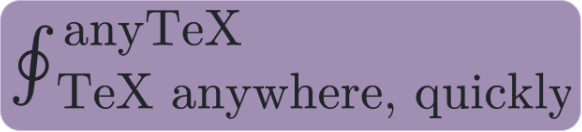
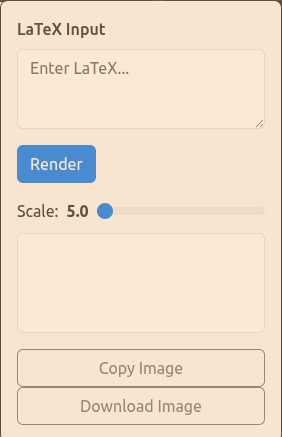

<a id="readme-top"></a>
[](LICENSE)


<!-- PROJECT LOGO -->
<br />
<div align="center">
  

<h3 align="center">anyTeX</h3>

  <p align="center">
    Write, Render and Screenshot TeX quickly in a popup.
    <br />
    <a href="https://github.com/winkt0/anyTeX/issues/new?labels=bug&template=bug-report---.md">Report Bug</a>
    &middot;
    <a href="https://github.com/winkt0/anyTeX/issues/new?labels=enhancement&template=feature-request---.md">Request Feature</a>
  </p>
</div>


<!-- TABLE OF CONTENTS -->
<details>
  <summary>Table of Contents</summary>
  <ol>
    <li>
      <a href="#about-the-project">About The Project</a>
      <ul>
        <li><a href="#built-with">Built With</a></li>
      </ul>
    </li>
    <li>
      <a href="#getting-started">Getting Started</a>
      <ul>
        <li><a href="#prerequisites">Prerequisites</a></li>
        <li><a href="#installation">Installation</a></li>
      </ul>
    </li>
    <li><a href="#contributing">Contributing</a></li>
    <li><a href="#license">License</a></li>
  </ol>
</details>


<!-- ABOUT THE PROJECT -->
## About The Project

If you're frustrated with not being able to use TeX or LaTeX in Emails and chats, this tool is for you. Simply click on the icon dropdown, enter your TeX code, render and copy it as an image, or download it if you want to!



<p align="right">(<a href="#readme-top">back to top</a>)</p>


### Built With
|Tool   |Purpose   |
|---|---|
|[![Bun][bun-icon]][Bun-url]                 |Project setup, as bundler and package manager   |
|[![Bootstrap][Bootstrap.com]][Bootstrap-url]|CSS   |
|[![MathJax][Mathjax-icon]][Mathjax-url]     |Converting TeX and LaTeX input into actual rendered SVGs   |
|[[Html2Canvas]][html2canvas-url]            |Creating an image of the generated SVG so you can download or paste it wherever you want!   |


<p align="right">(<a href="#readme-top">back to top</a>)</p>


<!-- GETTING STARTED -->
## Getting Started

All you need to do is add the extension locally as shown below.

### Prerequisites

You only need bun and a Chromium-based browser. If you're on Mac or Linux, run the following command in the terminal to install Bun:
  ```sh
  curl -fsSL https://bun.com/install | bash
  ```

### Installation

1. Clone the repo and cd into it
   ```sh
   git clone https://github.com/winkt0/anyTeX.git
   cd anyTeX
   ```
2. Create the folder 'dist' by running
   ```sh
   bun run build
   ```
4. In your browser, go into extensions, click "Load unpacked" and select the dist folder you just created

That's it! AnyTeX should now be added as a popup in your extension bar.

<p align="right">(<a href="#readme-top">back to top</a>)</p>


<!-- CONTRIBUTING -->
## Contributing

Contributions are what make the open source community such an amazing place to learn, inspire, and create. Any contributions you make are **greatly appreciated**.

If you have a suggestion that would make this better, please fork the repo and create a pull request. You can also simply open an issue with the tag "enhancement".
Don't forget to give the project a star! Thanks again!

1. Fork the Project
2. Create your Feature Branch (`git checkout -b feature/AmazingFeature`)
3. Commit your Changes (`git commit -m 'Add some AmazingFeature'`)
4. Push to the Branch (`git push origin feature/AmazingFeature`)
5. Open a Pull Request

<p align="right">(<a href="#readme-top">back to top</a>)</p>


<!-- LICENSE -->
## License

Distributed under the MIT license. See the file `LICENSE` for more information.

<p align="right">(<a href="#readme-top">back to top</a>)</p>


<!-- MARKDOWN LINKS & IMAGES -->
<!-- https://www.markdownguide.org/basic-syntax/#reference-style-links -->
<!-- Shields.io badges. You can a comprehensive list with many more badges at: https://github.com/inttter/md-badges -->
[Bootstrap.com]: https://img.shields.io/badge/Bootstrap-563D7C?style=for-the-badge&logo=bootstrap&logoColor=white
[Bootstrap-url]: https://getbootstrap.com
[bun-icon]: https://img.shields.io/badge/Bun-000?logo=bun&logoColor=fff
[bun-url]: https://bun.com
[mathjax-icon]: https://www.mathjax.org/badge/mj_logo.png
[mathjax-url]: https://mathjax.org
[html2canvas-url]: https://html2canvas.hertzen.com 